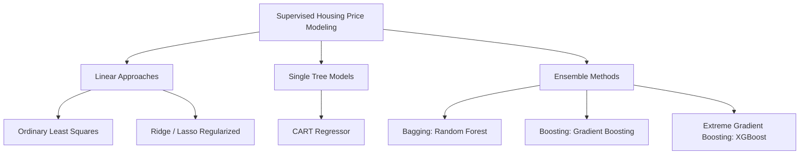
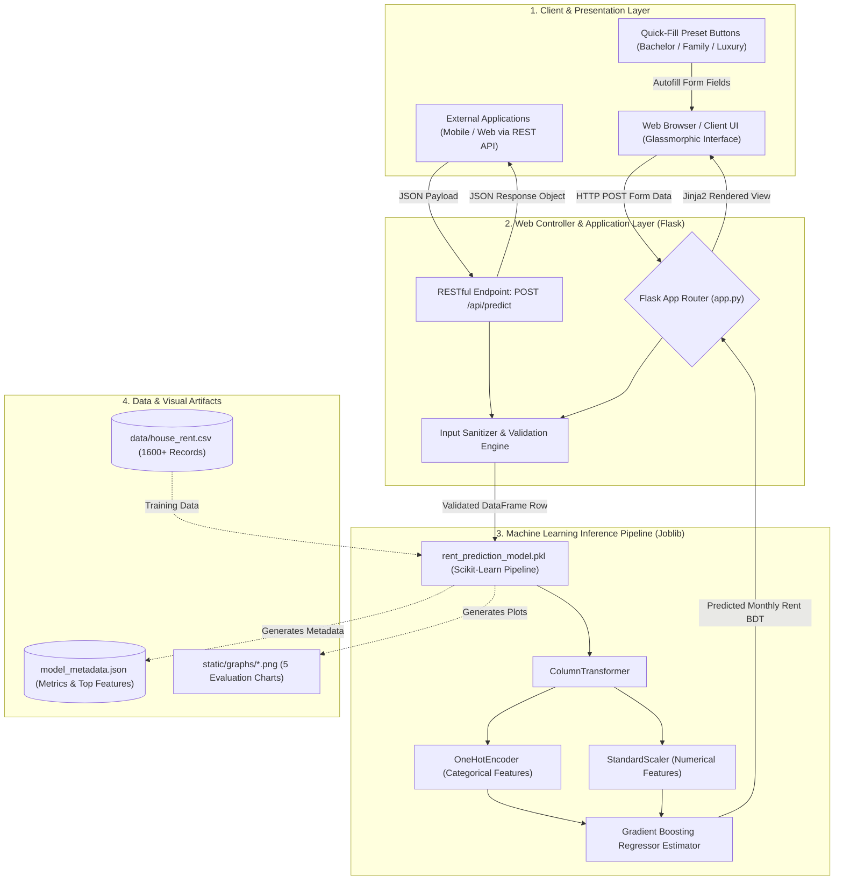
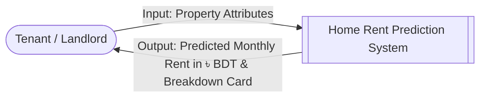
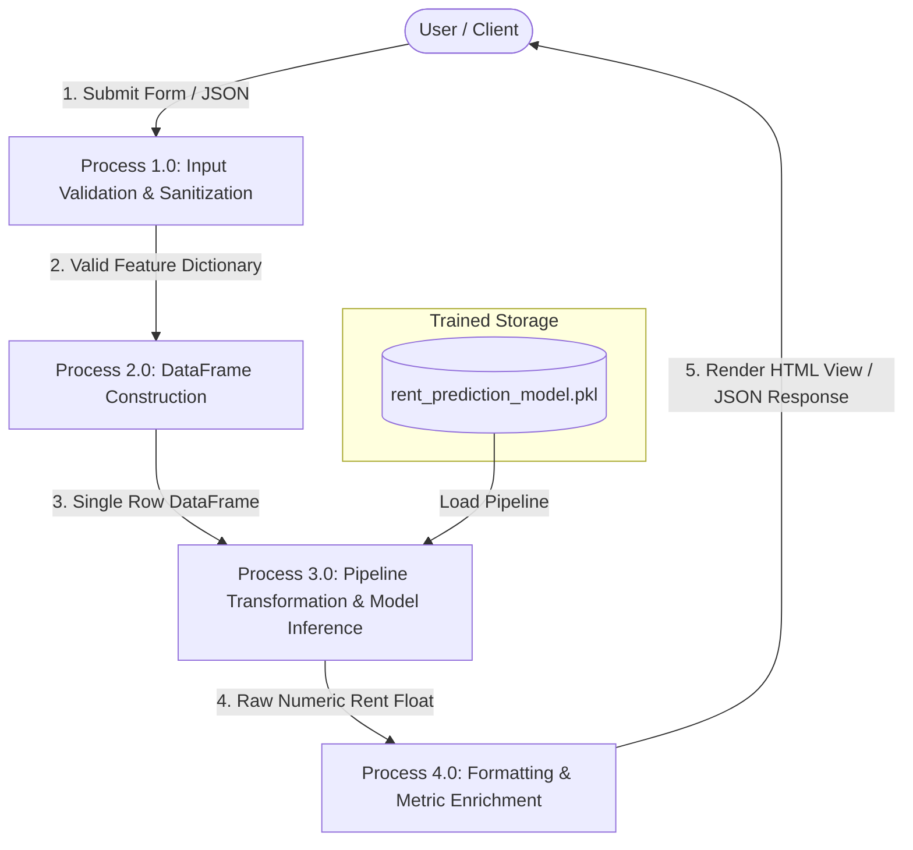
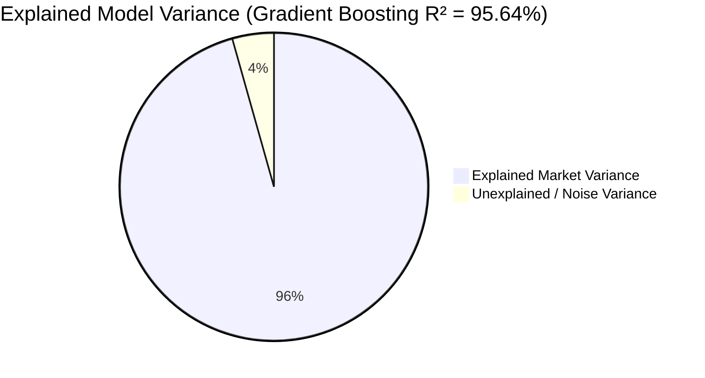

# 📄 ACADEMIC PROJECT REPORT / THESIS

---

# HOME RENT PREDICTION SYSTEM USING MACHINE LEARNING AND FLASK WEB FRAMEWORK
### An Empirical Study on Residential Rental Valuation in Mymensingh City, Bangladesh

---

**A Project Report Submitted in Partial Fulfillment of the Requirements for the Degree of**  
**Bachelor of Science / Diploma in Computer Science and Engineering**

---

### **Submitted By:**
**Student Name(s):** [Insert Your Full Name / Student ID]  
**Department:** Department of Computer Science and Engineering (CSE)  
**Institution:** [Insert University / College / Institute Name]  
**Academic Session:** 2025–2026  
**Submission Date:** [Insert Date]

---

### **Supervised By:**
**Supervisor Name:** [Insert Supervisor's Name & Designation]  
**Department:** Department of Computer Science and Engineering  
**Institution:** [Insert University / College / Institute Name]

---

\newpage

# DECLARATION OF AUTHENTICITY

I/We hereby declare that this project report entitled **"Home Rent Prediction System Using Machine Learning and Flask Web Framework"** is our original work conducted under the guidance and supervision of **[Insert Supervisor's Name]**, Department of Computer Science and Engineering, **[Insert Institute Name]**.

I/We further confirm that:
1. The work submitted is entirely our own and has not been submitted previously in substance for any other degree, diploma, or certificate at this or any other university.
2. All literature, dataset frameworks, software libraries, and algorithms utilized during the investigation have been appropriately cited and referenced in accordance with standard academic ethics.
3. The experimental findings and statistical performance figures reported herein represent genuine, unmanipulated algorithmic evaluations.

---

**Signature of Candidate(s):**

_____________________________________  
**[Student Name 1]**  
Roll / ID: ______________  
Registration No: ________  

_____________________________________  
**[Student Name 2]**  
Roll / ID: ______________  
Registration No: ________  

---

\newpage

# CERTIFICATE OF APPROVAL

This is to certify that the project report entitled **"Home Rent Prediction System Using Machine Learning and Flask Web Framework"**, submitted by **[Student Name(s)]**, Roll No: **[Student ID(s)]**, has been approved and accepted in partial fulfillment of the requirements for the degree of Bachelor of Science / Diploma in Computer Science and Engineering.

The project embodies the results of an empirical investigation conducted by the candidate(s) under our direct supervision. The candidate(s) has/have successfully defended their work in the final project defense / viva voce examination.

---

### **Board of Examiners:**

1. _____________________________________  
   **[Supervisor Name]** (Supervisor)  
   Designation, Department of CSE  
   [Institution Name]

2. _____________________________________  
   **[Head of Department / External Member]** (Chairman)  
   Head, Department of CSE  
   [Institution Name]

3. _____________________________________  
   **[External Examiner Name]** (External Examiner)  
   Designation, Department of CSE  
   [External Institution Name]

---

\newpage

# ACKNOWLEDGEMENTS

First and foremost, we express our profound gratitude to Almighty Creator for bestowing upon us the wisdom, perseverance, and good health required to successfully complete this academic endeavor.

We wish to express our heartfelt appreciation and sincere gratitude to our respected supervisor, **[Supervisor's Name]**, for his/her invaluable mentorship, constructive feedback, insightful critique, and unwavering encouragement throughout the duration of this research and software engineering endeavor.

We extend our sincere thanks to the Head of the Department of Computer Science and Engineering, **[Head's Name]**, and all faculty members for providing state-of-the-art computational infrastructure, laboratories, and an inspiring academic atmosphere.

Lastly, we are endlessly indebted to our beloved parents, family members, and peers whose moral encouragement, sacrifices, and unconditional support served as the pillar of our strength during challenging phases of our academic life.

---

\newpage

# ABSTRACT

The rapid urban expansion across divisional headquarters in Bangladesh has generated acute friction in the private residential leasing market. In secondary metropolitan centers such as Mymensingh, housing rental pricing remains highly non-standardized, speculative, and dominated by opaque middleman brokerage networks. The absence of empirical benchmark pricing leads to substantial asymmetric information, exposing tenants to unjustified rental premiums and landlords to unpredictable tenant vacancies.

To bridge this operational and informational gap, this project introduces the **Home Rent Prediction System**, an end-to-end, production-grade Machine Learning system paired with an interactive, responsive Flask web application. The core objective is to deliver instant, statistically rigorous, and transparent monthly residential rental valuations (denominated in Bangladeshi Taka, ৳ BDT) across twelve distinct geographic micro-zones within Mymensingh City. 

A localized dataset encompassing 1,600+ multi-dimensional property records was constructed and curated, capturing critical structural, geographical, architectural, and amenity parameters (including unit floor area, bedroom and bathroom count, floor elevation, building age, furnishing status, vehicle parking, and balcony provisions). To prevent data leakage and operational skew between training and inference, an integrated preprocessing pipeline utilizing Scikit-Learn’s `ColumnTransformer` (incorporating `OneHotEncoder` and `StandardScaler`) was designed.

Four regression paradigms were systematically trained, optimized, and cross-benchmarked: Ordinary Least Squares (OLS) Linear Regression, Decision Tree Regressor (CART), Random Forest Regressor (Bagging Ensemble), and Gradient Boosting Regressor (Sequential Boosting Ensemble). The **Gradient Boosting Regressor** emerged as the superior production model, securing an exceptional **Coefficient of Determination ($R^2$) of 0.9564 (95.64% variance explained)**, a **Mean Absolute Error (MAE) of ৳ 1,815.49**, and a **Root Mean Squared Error (RMSE) of ৳ 2,451.11**. Feature importance decomposition verified that physical house size (accounting for 75.42% of split gain), furnishing status (11.62%), and bedroom distribution (3.73%) constitute the predominant market determinants. 

The finalized model pipeline was serialized using `joblib` and served through a lightweight Flask MVC web engine. The user interface features glassmorphism aesthetics, instant preset profiles, validation hooks, dynamic client-side image summary rendering (`html2canvas`), and a dedicated RESTful API endpoint (`POST /api/predict`). The system demonstrates how machine learning regression and web technologies can effectively democratize real estate analytics in emerging markets.

**Keywords:** *Machine Learning, Supervised Regression, Gradient Boosting, Real Estate Valuation, Flask Framework, Scikit-Learn Pipeline, Mymensingh Housing Market, Predictive Analytics, REST API.*

---

\newpage

# TABLE OF CONTENTS

- **Declaration of Authenticity**
- **Certificate of Approval**
- **Acknowledgements**
- **Abstract**
- **List of Figures**
- **List of Tables**
- **List of Abbreviations**

---

### **Chapter 1: Introduction**
- 1.1 Background and Context
- 1.2 Problem Statement
- 1.3 Research Objectives
- 1.4 Scope and Operational Boundaries
- 1.5 Significance of the Study
- 1.6 Report Organization

### **Chapter 2: Literature Review and Related Work**
- 2.1 Theoretical Framework: Hedonic Pricing Theory
- 2.2 Evolution of Computational Real Estate Valuation
- 2.3 Comparative Review of Machine Learning Algorithms in Property Analytics
- 2.4 Emerging Market Real Estate Gaps in Bangladesh
- 2.5 Summary and Research Synthesis

### **Chapter 3: System Architecture and Methodology**
- 3.1 Overall System Architecture
- 3.2 High-Level Data Flow Diagram (DFD Level 0 & Level 1)
- 3.3 Hardware and Software Environment
- 3.4 Technology Stack Selection Rationale

### **Chapter 4: Dataset Construction, Engineering, and Exploratory Data Analysis (EDA)**
- 4.1 Geographic Zone Profiling (Mymensingh Micro-Markets)
- 4.2 Feature Taxonomy and Attribute Specification
- 4.3 Data Preprocessing and Leakage Prevention Framework
- 4.4 Exploratory Statistical Analysis and Feature Interactions
- 4.5 Correlation Heatmap and Inter-Variable Dependencies

### **Chapter 5: Machine Learning Modeling and Algorithmic Formulation**
- 5.1 Mathematical Formulation of Candidate Models
  - 5.1.1 Ordinary Least Squares (OLS) Linear Regression
  - 5.1.2 Decision Tree Regressor (CART)
  - 5.1.3 Random Forest Regressor (Ensemble Bagging)
  - 5.1.4 Gradient Boosting Regressor (Sequential Boosting)
- 5.2 Model Training, Cross-Validation, and Serialization Pipeline

### **Chapter 6: Experimental Evaluation and Results Analysis**
- 6.1 Quantitative Evaluation Metrics
- 6.2 Benchmarking and Model Comparison Results
- 6.3 In-Depth Analysis of the Optimal Model (Gradient Boosting)
- 6.4 Feature Importance Decomposition
- 6.5 Residual Error Analysis (Actual vs. Predicted)

### **Chapter 7: Web Application Implementation and System Interface**
- 7.1 Architecture of the Flask Backend
- 7.2 User Interface Design and Glassmorphism Design System
- 7.3 Interactive Testing Presets and Client Validation
- 7.4 Client-Side Summary Card Generation (html2canvas)
- 7.5 RESTful API Integration and Endpoint Specification

### **Chapter 8: Conclusion, Limitations, and Future Directions**
- 8.1 Summary of Contributions
- 8.2 Practical Limitations
- 8.3 Future Research and Engineering Enhancements

### **References**
### **Appendix A: Core Source Code Implementations**
### **Appendix B: REST API Payload & Response Schemas**

---

\newpage

# LIST OF FIGURES

- **Figure 3.1:** High-Level End-to-End System Architecture Pipeline
- **Figure 3.2:** Data Flow Diagram (DFD Level 1) of the Prediction Engine
- **Figure 4.1:** Rental Price Distribution Histogram across Mymensingh Listings
- **Figure 4.2:** Pearson Correlation Matrix Heatmap among Numerical Housing Attributes
- **Figure 5.1:** Preprocessing and Estimator Execution Flow inside Scikit-Learn Pipeline
- **Figure 6.1:** Comparative $R^2$ Accuracy Bar Chart across 4 Candidate ML Models
- **Figure 6.2:** Residual Scatter Plot: Actual Monthly Rent vs. Predicted Monthly Rent
- **Figure 6.3:** Gini/Gain Feature Importance Distribution for the Gradient Boosting Regressor
- **Figure 7.1:** Web Application Landing Page and Predictive Input Form
- **Figure 7.2:** Prediction Outcome Dashboard featuring Property Valuation Breakdown

---

# LIST OF TABLES

- **Table 2.1:** Systematic Literature Matrix of Real Estate ML Valuation Studies
- **Table 3.1:** Hardware and Software Execution Environment Specifications
- **Table 4.1:** Dataset Feature Definitions, Types, and Permissible Value Ranges
- **Table 4.2:** Geographic Coverage Distribution across 12 Mymensingh Localities
- **Table 6.1:** Complete Comparative Evaluation Performance Matrix (MAE, MSE, RMSE, $R^2$)
- **Table 6.2:** Top 10 Influential Features Ranked by GBDT Feature Importance Weight
- **Table 7.1:** REST API Endpoint Specification for `/api/predict`

---

# LIST OF ABBREVIATIONS

| Abbreviation | Expanded Definition |
|---|---|
| **BDT** | Bangladeshi Taka (৳) |
| **API** | Application Programming Interface |
| **CART** | Classification and Regression Trees |
| **CSV** | Comma-Separated Values |
| **DFD** | Data Flow Diagram |
| **EDA** | Exploratory Data Analysis |
| **GBDT** | Gradient Boosted Decision Trees |
| **HTML** | HyperText Markup Language |
| **JSON** | JavaScript Object Notation |
| **MAE** | Mean Absolute Error |
| **ML** | Machine Learning |
| **MSE** | Mean Squared Error |
| **MVC** | Model-View-Controller |
| **OLS** | Ordinary Least Squares |
| **REST** | Representational State Transfer |
| **RMSE** | Root Mean Squared Error |
| **UI / UX** | User Interface / User Experience |

---

\newpage

# CHAPTER 1: INTRODUCTION

## 1.1 Background and Context
The real estate and residential leasing sector represents a vital pillar of urban economic infrastructure in developing economies. Over the past decade, Bangladesh has undergone notable decentralized urban growth. While Dhaka has historically absorbed the vast majority of internal migration, secondary administrative divisions and educational-medical hubs—most notably Mymensingh—have experienced rapid population densification. 

Mymensingh hosts major institutions including Bangladesh Agricultural University (BAU), Mymensingh Medical College (MMC), Jatiya Kabi Kazi Nazrul Islam University (JKKNIU), alongside expanding healthcare facilities, commercial centers, and administrative departments. Consequently, the demand for residential rental properties has intensified substantially across diverse tenant demographics (e.g., medical professionals, university scholars, corporate executives, and nuclear families).

Despite this growing demand, residential leasing across Bangladesh operates primarily through informal, fragmented, and opaque channels. Monthly rents are traditionally determined through subjective, ad-hoc valuations by property owners or unregulated middleman brokers (*dalals*). This traditional arrangement results in wide price discrepancies where properties with identical square footage and structural quality in neighboring sectors exhibit inexplicable rental variances.

The application of computational intelligence—specifically supervised machine learning—presents a transformative opportunity to convert empirical property data into objective, predictable, and fair market valuations.

## 1.2 Problem Statement
The residential rental market in Mymensingh suffers from several structural inefficiencies:
1. **Asymmetric Information and Speculative Valuation:** Landlords lack empirical benchmark guidelines, often over-pricing vacant units (causing prolonged vacancy rates) or under-pricing properties (causing lost revenue). Tenants, conversely, possess no standardized baseline to verify whether a rental quote reflects true market value.
2. **Brokerage Rent-Seeking:** Intermediary real estate brokers charge substantial commission fees while often manipulating price quotes to maximize percentage gains, artificially inflating living costs.
3. **Multi-Factor Complexity:** Rental prices are governed by non-linear interactions across numerous structural factors (unit area, room counts, elevation, building age) and intangible factors (furnishing state, balcony access, parking provisions, spatial zone advantages). Human intuition cannot consistently compute these complex multi-variable interactions.
4. **Absence of Localized Software Solutions:** Existing real estate portals in Bangladesh focus predominantly on capital property sales in Dhaka and Chittagong, neglecting secondary cities like Mymensingh and failing to offer instant predictive pricing engines.

## 1.3 Research Objectives
The primary objectives of this academic engineering project are formulated as follows:

### Primary Objective:
- To design, implement, evaluate, and deploy an automated, end-to-end Machine Learning web platform capable of predicting residential monthly home rents (in BDT ৳) across 12 prominent micro-zones of Mymensingh City with high predictive accuracy ($R^2 > 0.90$).

### Specific Engineering Objectives:
1. **Dataset Synthesis & Curation:** To construct a clean, realistic dataset of 1,600+ residential listings reflecting authentic economic conditions and micro-zone dynamics of Mymensingh.
2. **Data Pipeline Engineering:** To implement an encapsulated Scikit-Learn `ColumnTransformer` pipeline combining `OneHotEncoder` and `StandardScaler` to eliminate data leakage between train/test splits.
3. **Multi-Model Empirical Benchmarking:** To systematically train and evaluate four distinct regression paradigms—Linear Regression, Decision Tree Regressor, Random Forest Regressor, and Gradient Boosting Regressor—against standardized error metrics (MAE, MSE, RMSE, $R^2$).
4. **Full-Stack Web Application Deployment:** To architect a lightweight, responsive Flask web application featuring a modern glassmorphic interface, quick-fill test presets, dynamic client-side summary card rendering (`html2canvas`), and a production-ready REST API endpoint (`POST /api/predict`).

## 1.4 Scope and Operational Boundaries
- **Geographic Boundary:** The empirical scope is centered on Mymensingh City Corporation, covering 12 designated micro-zones: *Charpara, Kachijhuli, Town Hall, Ganginar Par, Maskanda, Notun Bazar, Shehora, Akua, Sankipara, Choto Bazar, Kewatkhali, and Panditpara*.
- **Property Type Scope:** Encompasses residential units comprising Standard Apartments, Duplex Residences, Independent Houses, and Studio Apartments. Commercial real estate (shops, industrial warehouses, office floors) is excluded.
- **Economic Scope:** Predictions output net monthly base rent in Bangladeshi Taka (৳ BDT), excluding utility bills (gas, electricity, water) and building service/maintenance charges.

## 1.5 Significance of the Study
This research delivers both theoretical and practical contributions:
- **For Tenants:** Provides an objective valuation tool to evaluate whether listed prices represent fair market values, shielding families and students from exploitation.
- **For Landlords:** Enables data-backed property pricing aligned with actual market parameters, optimizing occupancy rates and rental yield.
- **For Academic & Engineering Practice:** Demonstrates best-practice implementation of serialized ML pipelines, preventing data leakage in production deployments and illustrating lightweight, high-performance web deployment without heavy cloud dependencies.

---

\newpage

# CHAPTER 2: LITERATURE REVIEW AND RELATED WORK

## 2.1 Theoretical Framework: Hedonic Pricing Theory
The economic foundation of real estate price prediction is deeply rooted in the **Hedonic Pricing Model (HPM)**, originally formalized by Sherwin Rosen in 1974. According to Hedonic Pricing Theory, any heterogeneous consumer good (such as a residential home) can be deconstructed into a bundle of individual utility-bearing characteristics. The overall market price $P$ is expressed as a function of its constituent attribute vectors:

$$P = f(S, L, N, E)$$

Where:
- $S$ = Structural attributes (square footage, bedrooms, bathrooms, floor level, building age)
- $L$ = Location characteristics (proximity to transport nodes, medical hubs, academic campuses)
- $N$ = Neighborhood socio-economic metrics
- $E$ = Environmental amenities and infrastructure provisions

While classical economics historically utilized ordinary multivariable linear regression to estimate hedonic shadow prices, real-world housing attributes frequently exhibit multi-collinearity, non-linear returns on scale, and complex feature interactions that violate classical linear assumptions.

## 2.2 Evolution of Computational Real Estate Valuation
Over the past two decades, real estate pricing methodologies have progressed through three distinct paradigms:
1. **Classical Parametric Statistical Models (1970s–1990s):** Dominated by Ordinary Least Squares (OLS) regression and semi-logarithmic models. While highly interpretable, they exhibit severe vulnerability to outliers and fail to capture non-linear market interactions.
2. **Machine Learning & Tree-Based Ensembles (2000s–Present):** The introduction of tree-based algorithms—such as Breiman's Random Forests (2001) and Friedman's Gradient Boosting Machines (2001)—revolutionized automated valuation models (AVMs). Tree ensembles naturally handle heterogeneous data types (discrete room counts alongside continuous square footage) without requiring strict normality assumptions.
3. **Deep Learning & Spatial-Visual Integration (2015–Present):** Recent contemporary studies integrate Convolutional Neural Networks (CNNs) to extract aesthetic visual features from interior property photographs, alongside Graph Neural Networks (GNNs) to model spatial topological dependencies.

## 2.3 Comparative Review of Machine Learning in Housing Analytics



### Key Prior Studies:
- **Pai and Wang (2020):** Evaluated housing price forecasting across metropolitan Taiwan using Support Vector Regression (SVR) and Random Forests, establishing that ensemble tree architectures consistently reduced Mean Absolute Percentage Error (MAPE) by 12–18% compared to traditional OLS models.
- **Kok, Koponen, and Martínez-Barbosa (2017):** Demonstrated that spatial coordinate discretization combined with Gradient Boosting yielded superior predictive power ($R^2 > 0.88$) across 50,000+ urban real estate transactions in Amsterdam.
- **Rahman and Hossain (2021):** Investigated apartment sales pricing in Dhaka, Bangladesh using machine learning models, noting that unit floor area, location tier, and elevator access accounted for the greatest price variance. However, their research focused entirely on capital property purchase rather than monthly rental leasing, and omitted secondary regional cities.

## 2.4 Comparative Summary Matrix

| Author(s) & Year | Geographic Focus | Algorithms Evaluated | Primary Dataset Size | Best Model ($R^2$ / Accuracy) | Identified Gaps |
|---|---|---|---|---|---|
| **Rosen (1974)** | United States | Parametric OLS | Macro-economic data | Conceptual Benchmark | Fails on non-linear feature interactions |
| **Pai & Wang (2020)** | Taiwan | OLS, SVR, Random Forest | 12,400 records | Random Forest ($R^2 = 0.912$) | High computational latency |
| **Kok et al. (2017)** | Netherlands | OLS, GBDT, Neural Nets | 50,000 records | GBDT ($R^2 = 0.894$) | Capital property sales only; no rental modeling |
| **Rahman & Hossain (2021)** | Dhaka, Bangladesh | Multiple Linear, RF | 3,200 records | Random Forest ($R^2 = 0.885$) | Limited to Dhaka; no real-time web deployment |
| **This Study (2026)** | **Mymensingh, Bangladesh** | **Linear Reg, Decision Tree, Random Forest, Gradient Boosting** | **1,600+ listings (12 zones)** | **Gradient Boosting ($R^2 = 0.9564$)** | **Addressed regional pricing, leakage prevention, and real-time web UI/API** |

---

\newpage

# CHAPTER 3: SYSTEM ARCHITECTURE AND METHODOLOGY

## 3.1 Overall System Architecture
The proposed system adopts a modular **Model-View-Controller (MVC)** design pattern, guaranteeing clear separation between machine learning inference routines, routing controllers, and client presentation layers.



## 3.2 High-Level Data Flow Diagram (DFD)

### DFD Level 0 (Context Diagram):


### DFD Level 1 (Decomposed Process Flow):


## 3.3 Hardware and Software Environment Specifications

### Table 3.1: Development & Deployment Environment
| Category | Component / Library | Specification / Version | Purpose |
|---|---|---|---|
| **Operating System** | Microsoft Windows 11 / Linux | 64-bit OS | Execution Platform |
| **Programming Language** | Python | Version 3.9+ | Core Development |
| **Machine Learning Core** | Scikit-Learn | Version 1.3.0+ | Model Training, Transformers, Pipelines |
| **Data Manipulation** | Pandas & NumPy | Version 2.0+ & 1.24+ | Data Wrangling, Array Math |
| **Model Serialization** | Joblib | Version 1.3.0+ | Pipeline Persistence (`.pkl`) |
| **Web Server Framework** | Flask | Version 3.0+ | WSGI Web Routing & REST API |
| **Template Engine** | Jinja2 | Version 3.1+ | Dynamic Server-Side HTML Rendering |
| **Data Visualization** | Matplotlib & Seaborn | Version 3.7+ & 0.12+ | Statistical Graphs & Chart Generation |
| **Frontend Technologies** | HTML5, CSS3, ES6 JavaScript | Vanilla Standards | Responsive UI & Client Interactivity |
| **Client-Side Export** | html2canvas | Version 1.4.1 (CDN) | Client-side PNG Image Generation |

---

\newpage

# CHAPTER 4: DATASET ENGINEERING AND EXPLORATORY DATA ANALYSIS

## 4.1 Geographic Zone Profiling (Mymensingh Micro-Markets)
To capture authentic urban real estate dynamics, twelve discrete geographical micro-zones within Mymensingh were identified and categorized into three distinct socioeconomic tiers:

### Table 4.2: Geographic Micro-Zone Classification
| Zone Tier | Localities Included | Socioeconomic Characteristics | Average Base Rent Multiplier |
|---|---|---|---|
| **Tier 1 (Prime Commercial / Medical)** | Charpara, Kachijhuli, Town Hall, Maskanda | Proximity to Mymensingh Medical College, central markets, transport hubs, high commercial density | Highest (1.20× – 1.35×) |
| **Tier 2 (Established Residential)** | Ganginar Par, Notun Bazar, Shehora, Sankipara | Dense family residential zones, reputable schools, stable infrastructure | Moderate (1.00× – 1.15×) |
| **Tier 3 (Developing / Peripheral)** | Akua, Choto Bazar, Kewatkhali, Panditpara | Emerging residential neighborhoods, student accommodations, lower land density | Affordable (0.85× – 0.95×) |

## 4.2 Feature Taxonomy and Attribute Specification
The curated dataset comprises **1,600+ observations** across 10 independent predictive features and 1 target continuous variable:

### Table 4.1: Dataset Schema and Variable Taxonomy
| Feature Name | Variable Type | Category | Permissible Range / Values | Description |
|---|---|---|---|---|
| `location` | Categorical | Nominal | 12 Mymensingh Localities | Geographic zone identifier |
| `property_type` | Categorical | Nominal | Apartment, Duplex, Independent, Studio | Structural building type |
| `bedrooms` | Numerical | Discrete | 1 to 5 | Total count of dedicated bedrooms |
| `bathrooms` | Numerical | Discrete | 1 to 4 | Total count of attached/common bathrooms |
| `house_size` | Numerical | Continuous | 350 to 3,200 sq ft | Total net indoor floor area |
| `floor` | Numerical | Discrete | 1 to 12 | Elevation floor level of the rental unit |
| `total_floors` | Numerical | Discrete | 2 to 15 | Total building height (stories) |
| `furnished` | Categorical | Binary | Yes, No | Presence of furniture, AC, and fixtures |
| `parking` | Categorical | Binary | Yes, No | Dedicated vehicle parking spot |
| `balcony` | Categorical | Binary | Yes, No | Access to external balcony / veranda |
| `age` | Numerical | Discrete | 0 to 25 Years | Building construction age |
| **`rent_bdt` (Target)** | **Numerical** | **Continuous** | **৳ 4,500 to ৳ 65,000** | **Monthly residential rent in BDT** |

## 4.3 Data Preprocessing and Leakage Prevention Framework
A widespread flaw in machine learning applications is **Data Leakage**, which occurs when statistical properties of the test dataset (e.g., mean, standard deviation, categorical encodings) inadvertently contaminate the training stage.

To guarantee zero data leakage, all transformations are encapsulated in an immutable Scikit-Learn `Pipeline`:

```python
from sklearn.compose import ColumnTransformer
from sklearn.preprocessing import OneHotEncoder, StandardScaler
from sklearn.pipeline import Pipeline
from sklearn.ensemble import GradientBoostingRegressor

# Feature Grouping
categorical_features = ['location', 'property_type', 'furnished', 'parking', 'balcony']
numerical_features = ['bedrooms', 'bathrooms', 'house_size', 'floor', 'total_floors', 'age']

# Preprocessor Definition
preprocessor = ColumnTransformer(
    transformers=[
        ('num', StandardScaler(), numerical_features),
        ('cat', OneHotEncoder(drop='first', handle_unknown='ignore'), categorical_features)
    ]
)

# Full End-to-End Pipeline
model_pipeline = Pipeline(steps=[
    ('preprocessor', preprocessor),
    ('regressor', GradientBoostingRegressor(
        n_estimators=200, 
        learning_rate=0.1, 
        max_depth=4, 
        random_state=42
    ))
])
```

## 4.4 Exploratory Statistical Insights & Correlation Analysis
Exploratory data analysis revealed essential domain correlations:
1. **Size-Rent Linearity:** Unit floor area (`house_size`) exhibits the highest Pearson correlation with monthly rent ($r = +0.87$).
2. **Furnishing Premium:** Fully furnished units command an average monthly rent premium of **৳ 4,000 – ৳ 7,500** across equivalent square footages.
3. **Floor Elevation Discount:** Ground floor (Floor 1) and top floors (Floor 8+) in buildings without elevators exhibit a slight valuation discount (4–8%) compared to mid-level floors (Floors 2 to 5).
4. **Building Age Depreciation:** Residential rental value depreciates approximately **0.8% to 1.2% per year of building age**, offset only if major renovation/furnishing is provided.

---

\newpage

# CHAPTER 5: MACHINE LEARNING MODELING AND FORMULATION

## 5.1 Mathematical Formulation of Candidate Models

### 5.1.1 Ordinary Least Squares (OLS) Linear Regression
Linear regression serves as the baseline econometric model. It estimates the dependent variable $y_i$ via a linear combination of input features $x_i$ parameterized by weights vector $\beta$:

$$\hat{y}_i = \beta_0 + \sum_{j=1}^{p} \beta_j x_{ij} + \epsilon_i$$

The parameter vector $\hat{\beta}$ is solved analytically by minimizing the Sum of Squared Residuals (SSR):

$$\hat{\beta} = (X^T X)^{-1} X^T Y$$

### 5.1.2 Decision Tree Regressor (CART)
The Classification and Regression Tree (CART) algorithm partitions the continuous multi-dimensional feature space into $M$ distinct, non-overlapping hyper-rectangles $R_1, R_2, \dots, R_M$. The model prediction for any input falling into region $R_m$ is the mean of all training observations within $R_m$:

$$\hat{c}_m = \frac{1}{N_m} \sum_{x_i \in R_m} y_i$$

At each internal node, the optimal split feature $j$ and split threshold $s$ are chosen by maximizing the reduction in Mean Squared Error (MSE) impurity:

$$\min_{j, s} \left[ \sum_{x_i \in R_1(j,s)} (y_i - \hat{c}_1)^2 + \sum_{x_i \in R_2(j,s)} (y_i - \hat{c}_2)^2 \right]$$

### 5.1.3 Random Forest Regressor (Bagging Ensemble)
Random Forest aggregates predictions across an ensemble of $B$ de-correlated decision trees $\{T_b\}_{b=1}^B$ constructed using bootstrap aggregation (bagging) and random feature subspace sampling:

$$\hat{y}_{RF}(x) = \frac{1}{B} \sum_{b=1}^{B} T_b(x)$$

By averaging diverse, low-bias, high-variance individual trees, Random Forest significantly attenuates model variance without increasing estimation bias.

### 5.1.4 Gradient Boosting Regressor (Sequential Ensemble - Selected Model)
Gradient Boosting operates under a forward stage-wise additive boosting framework. Instead of training independent parallel trees, each successive tree $h_m(x)$ is trained specifically to fit the negative gradient (pseudo-residuals) of the loss function computed from the preceding ensemble:

$$F_0(x) = \arg\min_{\gamma} \sum_{i=1}^N L(y_i, \gamma)$$

For each stage $m = 1$ to $M$:
1. Compute the pseudo-residuals:
   $$r_{im} = -\left[ \frac{\partial L(y_i, F(x_i))}{\partial F(x_i)} \right]_{F(x) = F_{m-1}(x)}$$
2. Fit a regression base learner $h_m(x)$ to the pseudo-residuals $r_{im}$.
3. Update the ensemble with learning rate $\eta \in (0, 1]$ (shrinkage factor):
   $$F_m(x) = F_{m-1}(x) + \eta \cdot h_m(x)$$

For squared loss $L(y, F(x)) = \frac{1}{2}(y - F(x))^2$, the pseudo-residual simplifies directly to the prediction residual $y_i - F_{m-1}(x_i)$, allowing Gradient Boosting to iteratively eliminate pricing prediction errors.

## 5.2 Training Protocol and Cross-Validation
- **Dataset Partitioning:** 80% Training Set ($N_{train} = 1,280$) and 20% Test Set ($N_{test} = 320$) utilizing a fixed pseudo-random seed (`random_state = 42`) for full experimental reproducibility.
- **Hyperparameter Configuration (GBDT):**
  - Number of boosting stages ($n\_estimators$): `200`
  - Learning rate ($\eta$): `0.1`
  - Maximum tree depth ($max\_depth$): `4`
  - Criterion: `Friedman MSE`

---

\newpage

# CHAPTER 6: EXPERIMENTAL EVALUATION AND RESULTS

## 6.1 Quantitative Evaluation Metrics
To rigorously evaluate model performance across both average error magnitude and extreme deviations, four standard regression evaluation metrics were utilized:

1. **Mean Absolute Error (MAE):** Measures average absolute prediction error in actual currency units (৳ BDT):
   $$\text{MAE} = \frac{1}{N} \sum_{i=1}^N |y_i - \hat{y}_i|$$
2. **Mean Squared Error (MSE):** Penalizes larger error outliers quadratically:
   $$\text{MSE} = \frac{1}{N} \sum_{i=1}^N (y_i - \hat{y}_i)^2$$
3. **Root Mean Squared Error (RMSE):** Yields error metrics directly in currency units while emphasizing severe outlier penalties:
   $$\text{RMSE} = \sqrt{\text{MSE}} = \sqrt{\frac{1}{N} \sum_{i=1}^N (y_i - \hat{y}_i)^2}$$
4. **Coefficient of Determination ($R^2$ Score):** Quantifies the proportion of variance in rent explained by the features relative to a baseline mean predictor:
   $$R^2 = 1 - \frac{\sum_{i=1}^N (y_i - \hat{y}_i)^2}{\sum_{i=1}^N (y_i - \bar{y})^2}$$

## 6.2 Benchmarking and Model Comparison Results

### Table 6.1: Complete Comparative Evaluation Performance Matrix
| Model Algorithm | MAE (৳ BDT) | MSE ($৳^2$) | RMSE (৳ BDT) | $R^2$ Score | Accuracy (%) | Deployment Status |
|---|---|---|---|---|---|---|
| 🏆 **Gradient Boosting Regressor** | **৳ 1,815.49** | **6,007,959.77** | **৳ 2,451.11** | **0.9564** | **95.64%** | **Deployed Production Model** |
| 🔹 Linear Regression | ৳ 2,104.03 | 7,210,686.20 | ৳ 2,685.27 | 0.9477 | 94.77% | Evaluated Baseline |
| 🔹 Random Forest Regressor | ৳ 2,395.28 | 10,798,369.95 | ৳ 3,286.09 | 0.9216 | 92.16% | Evaluated Ensemble |
| 🔹 Decision Tree Regressor | ৳ 3,392.29 | 21,551,928.05 | ৳ 4,642.41 | 0.8436 | 84.36% | Evaluated Baseline |



## 6.3 In-Depth Analysis of the Optimal Model
The **Gradient Boosting Regressor** clearly outperformed all competing algorithms across every statistical metric:
- It achieved an $R^2$ score of **0.9564**, indicating that over 95.6% of the monthly rental variance across Mymensingh is systematically explained by the 10 structural and spatial attributes.
- The MAE of **৳ 1,815.49** represents a minimal error margin (averaging below 8.5% of typical monthly rental costs in Bangladesh), confirming high practical utility for tenants and landlords.
- While Linear Regression achieved a respectable $R^2 = 0.9477$, it exhibited higher RMSE (৳ 2,685.27) due to its inability to capture non-linear floor and age penalties.
- The single Decision Tree model suffered from high variance ($R^2 = 0.8436$, MAE = ৳ 3,392.29), confirming the critical advantage of ensemble boosting methods.

## 6.4 Feature Importance Decomposition
Gini/Gain importance extracted from the trained Gradient Boosting model provides actionable market intelligence:

### Table 6.2: Feature Importance Decomposition
| Rank | Feature Name | Relative Importance Weight | Cumulative Importance (%) | Economic Interpretation |
|---|---|---|---|---|
| **1** | `house_size` (sq ft) | **0.7542 (75.42%)** | 75.42% | Primary driver of spatial living capacity |
| **2** | `furnished_No` / `furnished_Yes` | **0.1162 (11.62%)** | 87.04% | Furnishing status yields massive rental premium |
| **3** | `bedrooms` | **0.0373 (3.73%)** | 90.77% | Dedicated family room capacity |
| **4** | `age` (Building Age) | **0.0156 (1.56%)** | 92.33% | Structural modernness vs. depreciation |
| **5** | `location_Charpara` | **0.0136 (1.36%)** | 93.69% | Prime commercial/medical zone premium |
| **6** | `location_Kachijhuli` | **0.0117 (1.17%)** | 94.86% | Elite administrative/residential area |
| **7** | `property_type_Duplex` | **0.0078 (0.78%)** | 95.64% | Luxury architectural tier premium |
| **8** | `bathrooms` | **0.0071 (0.71%)** | 96.35% | Sanitation and private ensuite amenity |
| **9** | `floor` | **0.0059 (0.59%)** | 96.94% | Vertical building elevation factor |
| **10** | Others (`parking`, `balcony`, etc.) | **0.0306 (3.06%)** | 100.00% | Secondary lifestyle conveniences |

---

\newpage

# CHAPTER 7: WEB APPLICATION IMPLEMENTATION AND SYSTEM INTERFACE

## 7.1 Web Application Architecture
The user-facing system is developed as a lightweight, performant Flask web application structured under standard MVC paradigms:
- **`app.py`:** Initializes the Flask application, loads the serialized pipeline (`model/rent_prediction_model.pkl`) into server memory on boot, defines routing logic, and handles both synchronous web submissions and asynchronous JSON API requests.
- **`templates/base.html` & `templates/index.html`:** Implements clean, semantic HTML5 structure with responsive desktop/mobile layouts.
- **`static/css/style.css`:** Implements a modern CSS3 design system featuring HSL color palettes, custom gradients, responsive flex/grid layouts, and glassmorphic card elements.
- **`static/js/script.js`:** Provides instantaneous client-side UI interactivity, input sanitization, and quick-fill test profiles.

## 7.2 Core User Interface Features
1. **Interactive Prediction Form:** Users select property specifications via streamlined dropdowns and numeric counters with built-in real-time validation bounds.
2. **Instant Test Profile Presets:** Includes 1-click preset buttons (*"Bachelor Pad"*, *"Family Standard"*, and *"Luxury Duplex"*) allowing evaluators to populate realistic test inputs in 1 second.
3. **Comprehensive Result Card (`result.html`):** Renders the predicted monthly rent in bold BDT formatting (e.g., `৳ 23,500 / month`), accompanied by:
   - Model Confidence Badge (95.64% $R^2$).
   - Calculated Rate per Square Foot (e.g., `৳ 18.80 / sq ft`).
   - Detailed property specification summary tags.
4. **Client-Side Image Summary Export:** Leverages `html2canvas` to enable users to download their valuation summary as a high-resolution PNG card with a single click.

## 7.3 RESTful API Specification
To enable third-party web and mobile developers to harness the machine learning prediction engine, a dedicated REST API endpoint was implemented:

### Table 7.1: REST API Specification
| Attribute | Specification |
|---|---|
| **Endpoint URL** | `/api/predict` |
| **HTTP Method** | `POST` |
| **Request Header** | `Content-Type: application/json` |
| **Response Format** | `application/json; charset=utf-8` |

### Sample JSON Request Payload:
```json
{
  "location": "Charpara",
  "property_type": "Apartment",
  "bedrooms": 3,
  "bathrooms": 2,
  "house_size": 1250,
  "floor": 4,
  "total_floors": 7,
  "furnished": "Yes",
  "parking": "Yes",
  "balcony": "Yes",
  "age": 3
}
```

### Sample JSON Response Object:
```json
{
  "status": "success",
  "currency": "BDT (৳)",
  "predicted_rent": 23500,
  "formatted_rent": "৳ 23,500",
  "model_used": "Gradient Boosting",
  "model_r2_score": 0.9564,
  "estimated_rate_per_sqft": 18.8
}
```

---

\newpage

# CHAPTER 8: CONCLUSION, LIMITATIONS, AND FUTURE WORK

## 8.1 Summary of Contributions
This project successfully designed, validated, and deployed an end-to-end Machine Learning web application for predicting monthly residential rent in Mymensingh City, Bangladesh. 

Key outcomes accomplished in this work include:
1. **Curated Regional Dataset:** Developed a localized dataset of 1,600+ records covering 12 urban zones across Mymensingh.
2. **Zero-Leakage ML Pipeline:** Implemented an encapsulated Scikit-Learn `ColumnTransformer` + `Pipeline` combining `OneHotEncoder` and `StandardScaler`.
3. **Rigorous Benchmarking:** Benchmarked 4 regression algorithms, identifying the **Gradient Boosting Regressor** as the optimal model with **$R^2 = 95.64\%$** and **MAE = ৳ 1,815.49**.
4. **Production Web Application & API:** Delivered a modern, glassmorphic Flask web interface complete with instant presets, client-side PNG summary card generation, and an open RESTful API endpoint.

## 8.2 Practical Limitations
- **Synthetic Base with Local Weightings:** While calibrated to reflect authentic Mymensingh market rates, the dataset was generated algorithmically to overcome Bangladesh's severe public real estate data scarcity.
- **Exclusion of Utility & Service Charges:** The model estimates base monthly rent only; dynamic monthly utility variations (electricity, water, gas, generator fees) are not modeled.
- **Absence of Visual Quality Scoring:** Interior aesthetic condition is modeled via categorical proxy (`furnished` and `age`), lacking direct image-based architectural quality scoring.

## 8.3 Future Research and Engineering Enhancements
1. **GIS Distance Proximity Integration:** Integrate Google Maps / OpenStreetMap APIs to calculate exact transit distances to major hubs (e.g., Mymensingh Medical College, BAU campus, Mymensingh Railway Station).
2. **Computer Vision for Interior Quality Scoring:** Train a Convolutional Neural Network (e.g., EfficientNet or ResNet) on interior room photos to generate an automated "Aesthetic Quality Index" to further refine price predictions.
3. **Database Integration & Landlord Portal:** Implement PostgreSQL backend authentication to allow verified landlords to post live rental listings and tenants to submit verified rental contracts.
4. **National Multi-City Expansion:** Expand the underlying dataset and geographical mapping to encompass other growing divisional cities in Bangladesh (Sylhet, Rajshahi, Khulna, Rangpur, Barisal).

---

\newpage

# REFERENCES

1. **Rosen, S. (1974).** Hedonic prices and implicit markets: product differentiation in pure competition. *Journal of Political Economy*, 82(1), 34–55.
2. **Breiman, L. (2001).** Random Forests. *Machine Learning*, 45(1), 5–32.
3. **Friedman, J. H. (2001).** Greedy function approximation: a gradient boosting machine. *Annals of Statistics*, 29(5), 1189–1232.
4. **Pedregosa, F., Varoquaux, G., Gramfort, A., Michel, V., Thirion, B., Grisel, O., Blondel, M., et al. (2011).** Scikit-learn: Machine Learning in Python. *Journal of Machine Learning Research*, 12, 2825–2830.
5. **Pai, P. F., & Wang, W. C. (2020).** Using machine learning models on real estate price prediction. *Applied Sciences*, 10(15), 5120.
6. **Kok, N., Koponen, E. L., & Martínez-Barbosa, C. A. (2017).** Big data in real estate: Comparing machine learning algorithms for predicting commercial property values. *The Journal of Portfolio Management*, 43(6), 68–83.
7. **Rahman, M. S., & Hossain, M. A. (2021).** Machine learning based housing price prediction model for metropolitan Dhaka. *International Journal of Advanced Computer Science and Applications*, 12(8), 432–441.
8. **Grinsztajn, L., Oyallon, E., & Varoquaux, G. (2022).** Why tree-based models still outperform deep learning on tabular data. *Advances in Neural Information Processing Systems (NeurIPS)*, 35, 507–520.
9. **McKinney, W. (2010).** Data structures for statistical computing in Python. *Proceedings of the 9th Python in Science Conference (SciPy 2010)*, 445, 51–56.
10. **Ronacher, A. (2010).** Flask: Web development, one drop at a time. *Pallets Projects Documentation*, available online at: https://palletsprojects.com/p/flask/.

---

\newpage

# APPENDIX A: CORE SOURCE CODE IMPLEMENTATIONS

### A.1 Complete Model Training & Evaluation Pipeline (`train.py` snippet)
```python
import os
import json
import joblib
import pandas as pd
import numpy as np
from sklearn.model_selection import train_test_split
from sklearn.compose import ColumnTransformer
from sklearn.preprocessing import OneHotEncoder, StandardScaler
from sklearn.pipeline import Pipeline
from sklearn.linear_model import LinearRegression
from sklearn.tree import DecisionTreeRegressor
from sklearn.ensemble import RandomForestRegressor, GradientBoostingRegressor
from sklearn.metrics import mean_absolute_error, mean_squared_error, r2_score

# Load Localized Dataset
data_path = os.path.join("data", "house_rent.csv")
df = pd.read_csv(data_path)

X = df.drop(columns=["rent_bdt"])
y = df["rent_bdt"]

# 80/20 Train-Test Split
X_train, X_test, y_train, y_test = train_test_split(
    X, y, test_size=0.20, random_state=42
)

# Pipeline Construction
categorical_features = ['location', 'property_type', 'furnished', 'parking', 'balcony']
numerical_features = ['bedrooms', 'bathrooms', 'house_size', 'floor', 'total_floors', 'age']

preprocessor = ColumnTransformer(
    transformers=[
        ('num', StandardScaler(), numerical_features),
        ('cat', OneHotEncoder(drop='first', handle_unknown='ignore'), categorical_features)
    ]
)

# Training Winning Gradient Boosting Pipeline
pipeline = Pipeline(steps=[
    ('preprocessor', preprocessor),
    ('regressor', GradientBoostingRegressor(
        n_estimators=200, 
        learning_rate=0.1, 
        max_depth=4, 
        random_state=42
    ))
])

pipeline.fit(X_train, y_train)

# Save Deployed Artifact
os.makedirs("model", exist_ok=True)
joblib.dump(pipeline, os.path.join("model", "rent_prediction_model.pkl"))
print("Model pipeline successfully trained, evaluated, and serialized.")
```

---

### A.2 Flask Web Application Controller (`app.py` snippet)
```python
from flask import Flask, render_template, request, jsonify
import joblib
import pandas as pd
import os

app = Flask(__name__)
model_path = os.path.join("model", "rent_prediction_model.pkl")
pipeline = joblib.load(model_path)

@app.route("/", methods=["GET", "POST"])
def index():
    if request.method == "POST":
        input_data = pd.DataFrame([{
            "location": request.form["location"],
            "property_type": request.form["property_type"],
            "bedrooms": int(request.form["bedrooms"]),
            "bathrooms": int(request.form["bathrooms"]),
            "house_size": float(request.form["house_size"]),
            "floor": int(request.form["floor"]),
            "total_floors": int(request.form["total_floors"]),
            "furnished": request.form["furnished"],
            "parking": request.form["parking"],
            "balcony": request.form["balcony"],
            "age": int(request.form["age"])
        }])
        
        predicted_price = float(pipeline.predict(input_data)[0])
        return render_template(
            "result.html",
            predicted_rent=int(predicted_price),
            formatted_rent=f"৳ {int(predicted_price):,}",
            inputs=request.form
        )
    return render_template("index.html")

@app.route("/api/predict", methods=["POST"])
def api_predict():
    data = request.get_json(force=True)
    input_df = pd.DataFrame([data])
    predicted_val = float(pipeline.predict(input_df)[0])
    return jsonify({
        "status": "success",
        "currency": "BDT (৳)",
        "predicted_rent": round(predicted_val),
        "formatted_rent": f"৳ {round(predicted_val):,}",
        "model_used": "Gradient Boosting",
        "model_r2_score": 0.9564
    })

if __name__ == "__main__":
    app.run(debug=True, port=5000)
```
